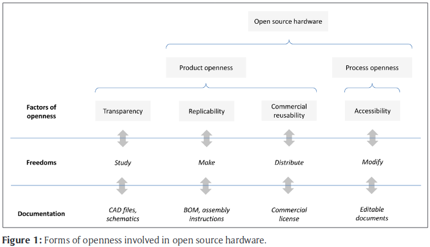
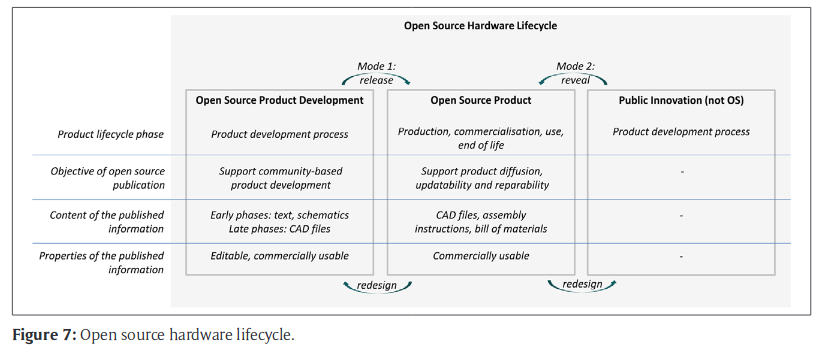

# What is the “Source” of Open Source Hardware?

Both  practitioners  and  the  scientific  community  gen-erally  acknowledge  that  online  sharing  of  a  piece  of  hardware  is  more  difficult  than  the  sharing  of  a  piece  of  software  (for  example  see  discussion  of  this  point  in  Raasch  and  Herstatt  2011). 
Hardware  may  need  to  be  described  through  more  complex  constructs  like  2D  or  3D schematics, which may require more specific software to  be  edited  and  displayed. 

When a piece of hardware is poorly documented, is it still open source? What does “less documented” mean? What are  the  minimal  requirements  for  labelling  a  hardware  product as open source?

Unlike  in  software,  attributing  appropriate  licences1  is  not  sufficient  to  call  hardware  open  source.  Given  OSH  is  a  sociotechnical  phenomenon,  the  answer  primarily  depends  on  how  the  product  documentation  enables co-development and replication. 

#challenges 
Like free and open source software, OSH is an IT-enabled internet  phenomenon.  Fjeldsted  et  al.  (2012)  as  well  as  Bonvoisin  and  Boujut  (2015)  point  out  the  integral  part  IT  platforms  play  in  fostering  product-related  data  shar-ing,  community-based  product  development  as  well  as  the  emergence  of  OSH-based  business  models.  However,  Raasch  and  Herstatt  (2011)  draw  a  contrast:  compared  with  OSS  development,  the  aspect  of  physical  object design in OSH has strong impacts on required skills, tools, and infrastructure. This aspect is even increasingly salient as the focus of OSH progressively expands towards many other  forms  of  hardware  than  electronic  hardware,  like  mechanical, construction, medical, optical, agricultural or textile hardware. From a design-point-of-view, the degrees of  freedom  in  the  problem-solution  space  introduced  by  their  mechanical  portion  rise  significantly.  Howard  et  al.  (2012)  and  Raasch,  Herstatt,  and  Balka  (2009)  also  illus-trate how OSH is looking at the full spectrum of product complexity  and  different  manufacturing  strategies,  from  DIY to industrial production.

#challenges
The  capacity  of  communities  outside  the  closed  and  hierarchical environment of R&D departments to develop complex and high quality products remains a challenge—the  largest  majority  of  OSH  products  available  to  date  being  gadgets  for  hobbyists  (Hansen  and  Howard  2013).

OSH can be described as individual or participatory reali-sation of a shared product design.
Hence,  depending  on  the  product  scope  and  also  the  originator/s’  intent  to  foster  co-design,  lev-els of interaction maturity differ starkly in OSH.
A useful macro-level  classification  is  offered  by  Camarinha-Matos  et  al.  (2009)  from  networks  to  coordination  to  coopera-tion to collaboration.

The  conceptual  space  that  supports  collective  spirit  and collaborative problem solving is described by Maher, Paulini, and Murty (2011). It is based on the three aspects of shared representation, motivation and communication. They enable problem solving in collective design projects within a continuum from collected (individual) to collective intelligence. 

Collective inteligence: collaborative  generation  of  solutions  as  well  as  synthesis  of  individual  solutions.  
From  their  study  of  collective  design  activities  Paulini, Murty, and Maher (2011) conclude that—within the frame of what they call an inclusive nature of participatory design—individuals  proactively  self-organise  and  choose  their  own  roles  as  well  as  period  of  involvement. 

In  the  OSH  context,  from  all  of  the  above,  communities  can  be  viewed  as  socially  formed  groups  of  heterogeneous  actors  who  co-create  OSH  products.  Depending on the participatory roles of actors, they may engage  as  followers,  replicators,  developers,  or  commu-nity managers. In the frame of open innovation, West and Lakhani (2008) describe them as actor volunteers lacking of  organisational  affiliation.  
 
In  addition,  actors  may  as  well include individuals, firms, as well as any other types of organizations (von Hippel 2005: 4, 165).
What  exactly  makes  open  source  processes  effective  seems  to  be  rooted  in  the  task  environment.
According  to Lee and Cole (2003), the trade-off between exploration and exploitation is made through a two-tier task structure of generated variations within the periphery and selection and retention at the core.
Moreover,  Howison  and  Crowston  (2014)  describe  collaborative  development  of  OSS  as  an  evolutionary  process  of  incremental  and  independent  tasks, by which a layer structure emerges task-by-task. They argue that added layers change the context over time and significantly reduce complexity of tasks. By gradually lay-ing the foundation, previously unattainable tasks eventu-ally may suddenly become easily achievable by individual developers, or simple workarounds may become obvious.

## Openness and docs

Freedoms  to  study,  to  edit  and  to  make  are  consistent  with  the  three  factors  of  openness  defined  by  Balka,  Raasch,   and   Herstatt   (2014).   They   respectively   term   these  factors  transparency, accessibility  and  replicability.

Transparency  refers  to  the  possibility  for  any  interested  person  to  access  sufficient  information  to  understand  the   product   in   detail   without   restriction   (equals   the freedom  to  study).  Accessibility  refers  to  the  possibility  for  any  interested  person  to  edit  design  information  and therefore to further develop the product (equals the freedom  to  modify).  Replicability  refers  to  the  possibility  for   any   interested   person   to   physically   produce   the  fredom to make). 
Transparency    enables      observation      (and      eventually      feedback),      accessibility enables further development (and eventually co-development)  and  replicability  enables  prototyping  and  production  (and  eventually  co-production).  What  is  missing  in  this  contribution  is  the  fourth  factor  of  openness termed henceforth commercial usability, which addresses the above listed freedom to distribute.

Transparency,  replicability  and  commercial  usability  are  about  sharing  documentation  publicly.  Accessibility  is  about  enabling  the  participation  of  external  people  in  the  design  process.  

Aitamurto,  Holland,  and  Hussain  (2015) term two meanings of openness: process openness(whether  the  innovation  process  is  open  or  closed)  and  product  openness  (whether  the  innovation  outcome  is  open  or  closed).  

Huizingh  (2011)  defines  open  source  innovation   as   a   result   of   both   process   and   product   openness. 

A synthesis of these approaches is in the figure

### Open hardware and docs

Based  on  interviews  with  originators  of  OSH  products,  Bonvoisin  et  al.  (2017)  defined  the  contours  of  two  archetypes   of   projects   developing   OSH   they   termed   development  communities  and  isolated  innovators. 

Devel-opment  communities  are  characterized  by  high  process  openness, adopt systematic and early release policies and gather contributions from a larger and permeable group of people. On the contrary, isolated innovators are charac-terized by a low process openness. They do not gather con-tributions from the outside, rather they release complete product  documentations  after  product  versions  are  fully  developed.
 
Transparency  is  not  associated  with  high  additional  costs, as it is related to the publication of files which are required in the development process (CAD files and sche-matics).

The   lower   occurrence   rate   of   replicability   may   be   explained by the corresponding additional effort. Indeed, it  requires  more  resources  to  make  a  product  replicable  than  transparent  or  commercially  usable.  Furthermore,  while   transparency   is   about   sharing   files   which   are   required for the development process of the product and exist  whether  or  not  the  product  is  open  source,  repli-cability  requires  the  formalization  of  assembly  instruc-tions  and  bill  of  materials,  which  is  a  time  intensive  activity. 

The  lower  occurrence  rate  of  accessibility  may  also  be   explained   by   the   corresponding   additional   effort.   As  introduced  earlier,  accessibility  is  a  precondition  for  the    emergence  of  a  community-based  co-development  process.  Integrating  contributions  from  a  development  community  implies  significant  coordination  costs  and  requires  dedicated  resources.  As  accessibility  supports  a  process which is difficult to implement in practice, not all product originators may give this aspect a high priority

A  first  possible  reason  for  the  absence  of  published  documentation  may  be  that  this  documentation  does  not  exist  and  cannot  exist  in  the  level  of  detail  required  by the criterion used here. Indeed, in early design stages, the  product  documentation  may  not  be  mature  enough  for  the  product  concept  to  be  formalized  into  CAD  files,  assembly instructions and bills of materials.

The  percentage  of  products  satisfying  the  criterion  of  transparency grows along with product maturity: it is lower than 54% in the concept and prototype phases and grows over 89% in the other phases. The average openness index increases as well, however, it starts to sink again at the last stage (full product production) due to lower replicability and  commercial  reusability. 

A  second  possible  reason  for  the  absence  of  published  documentation may be that the community which drove the  product  development  is  not  active  anymore.  In  that  case there is not enough workforce anymore to maintain data  online;  links  become  “dead  links”  and  information  finally disappears. This explanation tends to be supported by  the  gathered  data,  as  the  average  openness  index  is  significantly higher for products with active surrounding communities  than  for  products  with  inactive  communi-ties (respectively 4.57 points and 2.91 points).

These results tend to highlight the existence of two OSH project  archetypes:  the  one  using  openness  as  a  way  to  support  the  emergence  of  collaborative  development  in  communities,  the  other  using  openness  as  a  way  to  sup-port the broad diffusion of the outcome of a conventional and closed product development process. 

### discussion
Whereas   none   of   the   four   openness   factors   are   represented  by  more  than  three  fourths  of  the  gathered  products,  the  two  factors  transparency  and  commercial usability  are  nonetheless  considered  mandatory  by  most  practitioners. 

Transparency is the most represented  openness  factor  and  the  non-compliance  to  this  factor  can  be  largely  explained  by  the  fact  that  some  products  are  not  mature  enough  for  CAD  files  to  be  produced  and  published.  Commercial  usability  can  simply be considered as mandatory as it is the only factor of openness explicitly addressed in both the Open Source Definition  and  the  Open  Source  Hardware  Statement  of  Principles  1.0.  Furthermore,  it  can  be  viewed  as  a  prerequisite to flank transparency.

The  somewhat  optional  nature  of  the  two  other  open-ness   factors   accessibility   and   replicability   bases   the   identification  of  two  main  product  development  pro-ject  archetypes  in  OSH.  One  makes  use  of  open  source  publication of product-related documentation as a means to   support   community-based   product   development, while the other makes use of these same means for sup-porting  diffusion  of  their  privately  developed  product.  

#### Archetype 1 

Within   the   product   development   process,   an   open   source approach may be used as a means to support the emergence  of  community-based  product  development.  The OSH product is then before all the object of an open source product development process (state 1 in Figure 7). In order to be labelled as “open source”, this process requires at least commercial usability, transparency and accessibil-ity. At early development stages, transparency can only be realized  through  the  publication  of  descriptive  text  and  simple schematics. Along the development of the product,stable  technical  drawings  emerge  (CAD  files)  which  have  to  be  shared  in  order  to  support  further  collaborative  development.  Accessibility  is  ensured  by  the  use  of  edit-able formats (e.g. native and open CAD formats instead of STL files, native and open text editor files instead of PDF files).

Once a product is fully defined and can be produced, it can be documented as an open source product (state 2 in Figure 7). In this case, open source is used to support the production  and  diffusion  of  the  product  and  its  durabil-ity  (through  reparability,  modifiability  and  upgradabil-ity). 

In order to be labelled as “open source”, this product can be delivered with additional information, such as bill of  materials  and  assembly  instructions,  which  support  production.  Making  use  of  this  information  for  actual  production and commercialization purposes requires this content  to  be  published  with  licences  allowing  commer-cial  usage.  During  the  usage  phase  and  at  the  product  end-of-life,  access  to  this  same  information  may  support  the aspects of durability mentioned above.

An  open  source  product  can  either  be  the  result  of  an  open  source  product  development  process  (mode  1  in  Figure  7)  or  of  the  disclosing  of  documentation  devel-oped  in  a  private  setting—defined  as  public  innovation(mode  2  in  Figure  7)  by  Huizingh  (2011).  Note  that  the  latter  is  not  an  open  source  development  approach,  because it neither supports accessibility nor transparency.

The  results  highlight  a surprisingly large share of products which are provided with barely any information at all (cluster C5, 18%). This could either be due to a misinterpretation of the concept of  OSH,  a  deliberate  intention  to  “openwash”  a  product,  or the influence of the time variable. 
